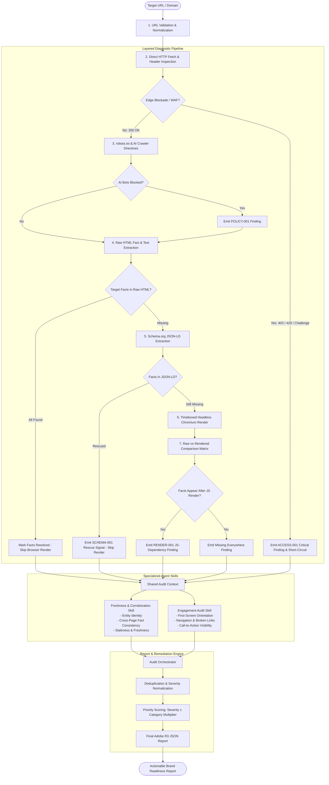

# 🔍 Brand AI Readiness Audit — Agent Skill Marketplace

<p align="center">
  
  
  
  
  
</p>

---

## 📌 Executive Summary

Modern search and information discovery have fundamentally shifted. Consumers no longer search solely via traditional blue links—they rely on **Search Generative Experiences (SGE)** and **Autonomous AI Agents** (ChatGPT, Perplexity, Claude, Google Gemini) to discover, evaluate, and purchase from brands.

If an AI crawler cannot reach your product prices, if your key specifications are trapped behind client-side JavaScript execution, if your robots policies block AI retrieval bots, or if your brand claims contradict each other across pages, **your brand is invisible to the next generation of digital commerce.**

The **Brand AI Readiness Audit** is an enterprise-grade, portable **Agent Skill Marketplace** that audits any public brand website for two critical dimensions:
1. 🤖 **AI Discoverability & Machine Comprehension** — Can AI retrieval systems and crawlers extract authoritative brand facts without friction?
2. 👥 **Human Visitor Engagement & Conversion** — Can human visitors immediately orient, navigate, and convert once they land?

---

## 🎯 How Our Project Solves the Adobe Problem Statement (Brand Visibility)

The Adobe Hackathon Round 3 challenge asks: *"How can brands ensure their content and products remain discoverable, trustworthy, and actionable in an AI-first web ecosystem?"*

Our platform directly fulfills the Adobe Problem Statement through **5 core pillars**:

| Adobe PS Core Requirement | How Our Solution Meets & Exceeds It | Implementation Module |
|---|---|---|
| **1. Machine Discoverability & AI Crawlability** | Inspects HTTP status codes, edge WAF/bot challenges (Akamai, Cloudflare), sitemap discovery, and explicitly evaluates AI-specific bot policies (`GPTBot`, `PerplexityBot`, `ClaudeBot`, `Google-Extended`, `Amazonbot`). | [`crawl-render-audit/scripts/ai_robots.py`](file:///c:/Users/Krish%20Bhandari/Downloads/brand/brand-ai-readiness-audit/skills/crawl-render-audit/scripts/ai_robots.py) |
| **2. Client-Side Rendering (CSR) Fact Traps** | Distinguishes superficial DOM expansion from genuine data loss. Evaluates if critical product/brand facts are present in raw HTML, rescued via Schema.org JSON-LD, or trapped strictly in JavaScript execution. | [`crawl-render-audit/scripts/facts.py`](file:///c:/Users/Krish%20Bhandari/Downloads/brand/brand-ai-readiness-audit/skills/crawl-render-audit/scripts/facts.py) |
| **3. Brand Truth, Consistency & Freshness** | Extracts brand identity signals (entity names, slogans, pricing, contact details) across multiple pages to detect conflicting claims, ambiguous identities, or stale information. | [`freshness-corroboration/scripts/consistency.py`](file:///c:/Users/Krish%20Bhandari/Downloads/brand/brand-ai-readiness-audit/skills/freshness-corroboration/scripts/consistency.py) |
| **4. On-Site Visitor Engagement & Conversion** | Evaluates above-the-fold orientation, heading hierarchies (H1/H2), broken navigation links, and call-to-action (CTA) prominence to ensure human visitors convert. | [`engagement-audit/scripts/engagement.py`](file:///c:/Users/Krish%20Bhandari/Downloads/brand/brand-ai-readiness-audit/skills/engagement-audit/scripts/engagement.py) |
| **5. Standardized Evidence-Based Reporting** | Replaces vague scores with a strict Adobe Round 3 finding contract: deterministic IDs, severity ratings, concrete reproduction evidence, mechanisms, and prioritized suggested actions. | [`audit-orchestrator/scripts/orchestrator.py`](file:///c:/Users/Krish%20Bhandari/Downloads/brand/brand-ai-readiness-audit/skills/audit-orchestrator/scripts/orchestrator.py) |

---

## 🏛️ System Architecture & Execution Flow



---

## 🧩 Agent Skill Marketplace Structure

The repository conforms directly to the **Adobe Agent Skill Marketplace** specification defined in [`marketplace.json`](file:///c:/Users/Krish%20Bhandari/Downloads/brand/brand-ai-readiness-audit/marketplace.json):

```json
{
  "name": "brand-ai-readiness-audit",
  "version": "1.0.0",
  "skills": [
    { "id": "audit-orchestrator", "path": "skills/audit-orchestrator", "entrypoint": true },
    { "id": "crawl-render-audit", "path": "skills/crawl-render-audit" },
    { "id": "freshness-corroboration", "path": "skills/freshness-corroboration" },
    { "id": "engagement-audit", "path": "skills/engagement-audit" }
  ]
}
```

### Skill Catalog

| Skill Name | Path | Role | Key Capabilities |
|---|---|---|---|
| **`audit-orchestrator`** | `skills/audit-orchestrator/` | **Master Entrypoint** | Pipeline orchestration, shared context lifecycle, finding normalization, deduplication, priority scoring, final report synthesis. |
| **`crawl-render-audit`** | `skills/crawl-render-audit/` | **Core Technical Auditor** | HTTP reachability, WAF blockade detection, AI robots policy, raw/rendered fact matrix, JSON-LD extraction, Playwright rendering. |
| **`freshness-corroboration`** | `skills/freshness-corroboration/` | **Brand Fact Verifier** | Entity identity extraction, cross-page brand fact consistency checking, copyright/staleness detection. |
| **`engagement-audit`** | `skills/engagement-audit/` | **UX & Conversion Auditor** | Above-the-fold orientation, title/meta quality, H1/H2 hierarchy, navigation health, CTA clarity. |

> **Single-Crawl Multi-Skill Efficiency**: All downstream skills read from a single, unified `audit_context` generated during crawl time. This eliminates redundant network traffic, accelerates runtime, and guarantees all skills evaluate identical data snapshots.

---

## 🔬 Empirical Research: The 10-Site Validation Matrix

To avoid building toy heuristics, we validated our decision rules across **10 diverse real-world websites** spanning reference hubs, fintech, D2C e-commerce, banking, and SaaS:

| Target Website | Category | Key Architectural Trait | Diagnostic Validation Finding |
|---|---|---|---|
| **Wikipedia** | Reference | Static HTML baseline | Zero JS dependency, 100% raw machine readable facts. |
| **GitHub Docs** | Developer Docs | High-density markdown/HTML | Structured navigation, immediate raw accessibility. |
| **Stripe Docs** | Fintech Docs | Dynamic interactive tabs | Core API facts available in raw HTML; tabs render progressively. |
| **Zapier** | B2B SaaS | Modern dynamic framework | Strong JSON-LD structured data carrying service metadata. |
| **Nordstrom** | E-commerce | Akamai WAF protection | Emits `ACCESS-001` (403 WAF); correctly avoids making CSR claims under blockade. |
| **Healthline** | Healthcare | High-authority publisher | Strong raw HTML, but blocks AI bots in `robots.txt` (`POLICY-001`). |
| **Coursera** | EdTech | Heavy client-side React | Course metadata rescued via Schema.org JSON-LD (`SCHEMA-001`). |
| **Prashant Corner** | Local SMB | Catalog website | Simple static DOM with local contact and product details. |
| **Saraswat Bank** | Regional Banking | Static table data | Word count expands on render, but interest rates exist in raw table (NO false positive). |
| **Dot & Key** | D2C Skincare (Shopify)| Heavy JS widget expansion | DOM expands >30%, but product price exists in JSON-LD (`SCHEMA-001` rescue). |

### 🧠 Core Decision Rules & Counterexample Proofs

Our diagnostic rules follow one fundamental principle: **Observations first, conclusions second. Facts matter more than word counts.**

```text
❌ INCORRECT (Naïve approach):
   "Page has JavaScript or word count grew by 40% -> FAIL: Site is broken for AI"

✅ CORRECT (Our approach):
   Important Target Fact (e.g. Price: Rs. 495)
         ↓
   Present in Raw HTML? ───[YES]───> PASS (Instant Retrieval)
         ↓ [NO]
   Present in Raw JSON-LD? ─[YES]───> PASS / RESCUE (SCHEMA-001)
         ↓ [NO]
   Appears after JS Render? ─[YES]──> HIGH SEVERITY FINDING (RENDER-001)
         ↓ [NO]
   Missing Everywhere ──────────────> CRITICAL (DATA MISSING)
```

#### Validated Rule Summary

| Rule ID | Rule Trigger Condition | Severity | Rationale & Remediation |
|---|---|---|---|
| **`ACCESS-001`** | HTTP 403, 429, or WAF bot challenge blockades crawler | `critical` | AI retrieval bots cannot inspect or index blocked endpoints. |
| **`POLICY-001`** | `robots.txt` disallows AI User-Agents (`GPTBot`, `ClaudeBot`, etc.) | `high` / `medium` | Brand intentionally or accidentally opt-outs of LLM knowledge ingestion. |
| **`RENDER-001`** | Target fact missing from raw HTML & JSON-LD; appears only after JS execution | `high` | AI crawlers that do not execute client-side JS will miss critical brand facts. |
| **`SCHEMA-001`** | Target fact missing from raw HTML markup but present in JSON-LD | `info` (Rescue) | Positive signal: structured data prevents machine discoverability failure. |
| **`SCREEN-001`** | DOM expansion >30% and >100 words post-render | `low` (Warning) | Inspection flag only; does not generate failure unless target facts are trapped. |

---

## 🛡️ Safe & Polite Network Retrieval Engine

Our crawler (`crawler.py` / `http_fetch.py`) is engineered to be **100% read-only, respectful, and safe**:

```
                               SAFE BROWSING GUARANTEES
┌───────────────────────────────┬──────────────────────────────────────────────────────────────┐
│ 🔒 Read-Only GET Operations   │ Never issues POST, PUT, DELETE; never modifies server state. │
├───────────────────────────────┼──────────────────────────────────────────────────────────────┤
│ 🤖 Polite Identification     │ Identifies as "BrandAuditBot/1.0" in all HTTP headers.       │
├───────────────────────────────┼──────────────────────────────────────────────────────────────┤
│ 🛑 robots.txt Compliance      │ Reads and honors site crawler policies prior to deep crawl.  │
├───────────────────────────────┼──────────────────────────────────────────────────────────────┤
│ 🌐 Same-Domain Bounded        │ Strictly stays on the target domain; never wanders off-site. │
├───────────────────────────────┼──────────────────────────────────────────────────────────────┤
│ ⏱️ Rate-Limited Throttling    │ Built-in configurable delays between requests (default 1.0s).│
├───────────────────────────────┼──────────────────────────────────────────────────────────────┤
│ 🔄 Loop Prevention            │ Drops duplicate query params, utm_* tags, hashes, index.html.│
└───────────────────────────────┴──────────────────────────────────────────────────────────────┘
```

> **Local Execution Guarantee**: All network requests originate directly from your runtime environment. No third-party servers, external cloud dependencies, or unvetted endpoints are invoked.

---

## 🚀 Installation & Setup

### 1. Prerequisites
- Python 3.10, 3.11, 3.12, or 3.14+
- `pip` package manager

### 2. Clone Repository & Install Dependencies
```bash
# Clone repository
git clone https://github.com/RushikeshTathe/brand-ai-readiness-audit.git
cd brand-ai-readiness-audit

# Install required dependencies
pip install -r requirements.txt
```

### 3. (Optional) Install Headless Browser for Dynamic Rendering
If you wish to run deep browser rendering benchmarks with Playwright:
```bash
python -m playwright install chromium
```

---

## 💻 Usage Guide

### 1. Command Line Interface (CLI)

Run a complete audit from the terminal:

```bash
# Basic single-command audit
python skills/audit-orchestrator/scripts/orchestrator.py https://example.com

# Save report to custom file
python skills/audit-orchestrator/scripts/orchestrator.py https://example.com --output audit_report.json
```

#### CLI Options:
| Flag | Description | Default |
|---|---|---|
| `url` | **(Required)** Target website URL or domain | — |
| `--output`, `-o` | Output file path for JSON report | `stdout` |

---

### 2. Programmatic Python SDK

You can easily integrate the audit into Python scripts, CI/CD pipelines, or autonomous agent workflows:

```python
from skills.audit_orchestrator.scripts.orchestrator import orchestrate_audit

# 1. Run full multi-skill audit
report = orchestrate_audit("https://example.com")
print(f"Audit Score: {report['summary']['overall_score']}/100")
print(f"Total Findings: {report['summary']['total_findings']}")

# 2. Run targeted fact tracing (e.g. verify price & specifications)
target_facts = [
    {"key": "product_name", "value": "Vitamin C Serum"},
    {"key": "price", "value": "Rs. 495", "aliases": ["INR 495", "495"]}
]

detailed_report = orchestrate_audit("https://example.com/product", target_facts=target_facts)

for finding in detailed_report["findings"]:
    print(f"[{finding['severity'].upper()}] {finding['id']}: {finding['title']}")
    print(f"  Action: {finding['suggested_action']}\n")
```

---

## 📊 Standardized Report Output Schema

The orchestrator produces an **Adobe Round 3 compliant JSON report**:

```json
{
  "meta": {
    "version": "1.0.0",
    "timestamp": "2026-09-13T14:00:00+00:00",
    "duration_seconds": 3.42,
    "target_url": "https://example.com",
    "pages_crawled": 1
  },
  "summary": {
    "total_findings": 2,
    "critical": 0,
    "high": 1,
    "medium": 1,
    "low": 0,
    "info": 0,
    "overall_score": 85,
    "top_issues": [
      {
        "id": "RENDER-001",
        "title": "Important facts are JS-dependent",
        "severity": "high",
        "category": "html"
      }
    ]
  },
  "findings": [
    {
      "id": "RENDER-001",
      "skill": "crawl-render-audit",
      "category": "html",
      "severity": "high",
      "title": "Important facts are JS-dependent",
      "evidence": {
        "js_dependent_facts": ["price", "in_stock"]
      },
      "suggested_action": "Server-render critical facts or duplicate them in Schema.org JSON-LD.",
      "mechanism": "Facts missing pre-render force full JS execution to observe them.",
      "priority": 77,
      "confidence": "high"
    }
  ],
  "recommendations": [
    {
      "priority": 1,
      "category": "html",
      "title": "Important facts are JS-dependent",
      "suggested_action": "Server-render critical facts or duplicate them in Schema.org JSON-LD.",
      "severity": "high"
    }
  ]
}
```

---

## 🧪 Testing & Quality Assurance

Our test suite guarantees that all rules, schema contracts, and counterexamples pass deterministically:

```bash
# Run all tests via pytest
python -m pytest tests/
```

### Test Suite Coverage

- ✅ **`tests/test_basic_checks.py`** — URL validation, parameter stripping, canonical extraction, HTML structural analysis.
- ✅ **`tests/test_crawl_render_rules.py`** — Synthetic signal tests encoding the 4 key counterexamples (Dot & Key, Healthline, Nordstrom, Saraswat Bank).
- ✅ **`tests/test_finding_normalization.py`** — Severity validation, MD5 deterministic finding IDs, deduplication, priority scoring algorithms.
- ✅ **`tests/test_report_schema.py`** — Adobe Round 3 output schema compliance, required keys validation, timestamp parsing.
- ✅ **`tests/test_crawl_render_runtime.py`** — Per-site execution budget checks, short-circuit optimizations, WAF bypass verification.

---

## 📁 Repository Directory Structure

```text
brand-ai-readiness-audit/
├── marketplace.json                      # Agent Skill Marketplace manifest
├── requirements.txt                      # Project dependencies (requests, bs4, lxml, pytest, playwright)
├── pyrightconfig.json                    # IDE & static type analysis path configuration
├── README.md                             # Comprehensive project documentation
├── Adobe_R3_Audit_Research_README.md     # Empirical research notes & validation dataset
├── docs/                                 # Technical architecture & compliance guides
│   ├── compliance-check.md
│   └── crawl-render-components.md
├── skills/                               # Autonomous Agent Skills
│   ├── audit-orchestrator/               # [Skill 1] Entrypoint & Aggregation
│   │   ├── SKILL.md
│   │   └── scripts/
│   │       ├── __init__.py
│   │       └── orchestrator.py           # Master pipeline orchestrator
│   ├── crawl-render-audit/               # [Skill 2] Technical Retrieval & Facts Engine
│   │   ├── SKILL.md
│   │   ├── references/
│   │   └── scripts/
│   │       ├── ai_robots.py              # AI bot directives parser (GPTBot, ClaudeBot)
│   │       ├── audit.py                  # Layered single-page pipeline
│   │       ├── crawler.py                # Safe same-domain HTTP crawler
│   │       ├── facts.py                  # Fact presence comparison engine
│   │       ├── http_fetch.py             # Direct HTTP GET fetcher
│   │       ├── jsonld_facts.py           # Schema.org JSON-LD extractor
│   │       ├── page_analysis.py          # HTML heading, meta & alt-tag inspector
│   │       ├── renderer.py               # Timeboxed Playwright headless Chromium
│   │       ├── rules.py                  # 5 empirical decision rules
│   │       ├── sitemap.py                # Sitemap discovery & validator
│   │       ├── structured_data.py        # Microdata/RDFa/JSON-LD parser
│   │       ├── text_extract.py           # Text extraction & expansion metrics
│   │       └── waf_detector.py           # Provider-neutral WAF blockade detector
│   ├── freshness-corroboration/          # [Skill 3] Brand Consistency & Freshness
│   │   ├── SKILL.md
│   │   └── scripts/
│   │       └── consistency.py            # Cross-page brand fact integrity analyzer
│   └── engagement-audit/                 # [Skill 4] Visitor UX & Conversion Readiness
│       ├── SKILL.md
│       └── scripts/
│           └── engagement.py             # Orientation, navigation, CTA analyzer
└── tests/                                # Comprehensive Test Suite
    ├── test_basic_checks.py
    ├── test_crawl_render_rules.py
    ├── test_crawl_render_runtime.py
    ├── test_finding_normalization.py
    └── test_report_schema.py
```

---

<p align="center">
  <b>Built for Adobe University Hackathon 2026 — Round 3 (Agent Skill Marketplace)</b><br>
  Made with ❤️ by <b>Team Shastra Stack</b>
</p>