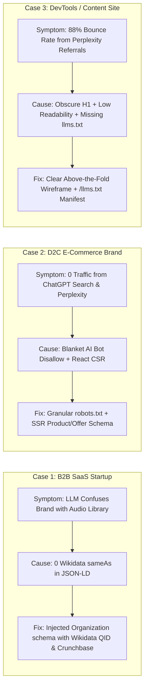

# Master Implementation Plan: Brand AI-Readiness Audit Marketplace
**Competition**: Adobe University Hackathon 2026 — Round 3 (Development Round)  
**Theme**: *"Speak to Agents: The New Language of Brand Visibility"*  
**Specification Standard**: [`agentskills.io`](https://agentskills.io)  
**Target Submission**: `brand-ai-readiness-audit.zip` (Clean, self-contained Agent Skill Marketplace)

---

## 1. Executive Summary & Problem Context

### Background & Round 2 Connection
In Round 2, teams analyzed the theoretical reasoning behind why brands become **invisible, stale, or misrepresented** inside conversational AI assistants (ChatGPT, Perplexity, Claude, Google Gemini/AI Overviews, Microsoft Copilot) and why referred visitors bounce immediately upon arrival. 

**Round 3 translates that reasoning into an automated, composable, production-grade Agent Skill Marketplace**. A general AI agent, pointed at any unseen website URL or domain, will execute this marketplace to audit the site across two foundational pillars:
1. **Off-Site AI Discoverability (AEO / GEO)**: Can AI crawlers find, read, trust, and quote facts from the site without rendering barriers, entity collisions, or crawler blockades?
2. **On-Site Engagement & Retention**: When human visitors arrive via AI referrals, does the page immediately orient them, retain conversational context, deliver high signal-to-noise information, and provide friction-free next steps?

The marketplace outputs a standardized, evidence-backed JSON audit report matching the exact schema specified on **Page 2** of the problem brief, complete with prioritized, mechanism-sound fixes and proactive strategic recommendations.

---

## 2. Official Evaluation Rubric & Strategic Scorecard

| Rubric Criterion | What Evaluators Look For | Our Architectural Implementation |
| :--- | :--- | :--- |
| **Detection Accuracy** | Correctly identifies real problems with concrete evidence; minimal false positives/negatives across discoverability and engagement. | Deterministic Python audit engines executing DOM tree traversal, robots.txt parsing, Schema.org extraction, and statistical text metrics with mathematical precision. |
| **Suggested-Action Quality** | Fixes are correctly targeted, mechanism-sound, and prioritized; beyond-problem suggestions are relevant and non-obvious. | Provides exact code snippets (JSON-LD `@graph`, granular `robots.txt` policies, `/llms.txt` templates) and proactive AEO recommendations. |
| **Output Design** | Clear, structured, actionable report matching the strict schema; easily actionable by non-experts. | 100% strict compliance with required JSON schema (`site`, `audited_at`, `summary`, `findings` with `id`, `title`, `severity`, `evidence`, `suggested_action`). |
| **Skill Format & Hygiene** | Full `agentskills.io` compliance; valid YAML frontmatter; deterministic, sandbox-safe, zero external dependency bloat. | Pure Python standard library implementation, self-contained references, clean progressive disclosure (`SKILL.md` -> `references/` -> `scripts/`). |
| **Marketplace Composition** | Genuine separation of concerns across focused sub-skills; seamless composition by a single designated entrypoint. | 4-Skill Modular Marketplace: `audit-orchestrator` (Entrypoint) composing 3 specialized audit skills. |
| **Generalization** | Functions robustly on unseen real-world sites without hardcoded site assumptions. | Universal web standards compliance (RFC 9309 robots.txt, Schema.org vocabulary, W3C DOM, Flesch-Kincaid readability). |

---

## 3. High-Level Marketplace Architecture & File Hierarchy

```
brand-ai-readiness-audit/                       <-- Marketplace Root (Zip Archive Root)
├── marketplace.json                            <-- Marketplace Manifest (4 skills, 1 entrypoint)
├── README.md                                   <-- Architecture, Composition Rationale, Setup & Usage
│
├── skills/
│   ├── audit-orchestrator/                     <-- [ENTRYPOINT SKILL] Composes sub-skills & emits final report
│   │   ├── SKILL.md                            <-- agentskills.io format: Orchestration procedure & tool definitions
│   │   ├── scripts/
│   │   │   ├── orchestrate_audit.py            <-- Master coordinator, deduplication, scoring & aggregator
│   │   │   └── report_formatter.py             <-- Strictly validates & formats JSON schema + Markdown summary
│   │   └── references/
│   │       ├── audit_schema.json               <-- Formal JSON Schema for report validation
│   │       └── severity_matrix.md              <-- Severity classification rules & impact scoring rubric
│   │
│   ├── ai-discoverability-audit/               <-- [SPECIALIZED SKILL 1] Infrastructure, Crawling & Token Budgets
│   │   ├── SKILL.md                            <-- agentskills.io format for AI bot access & rendering parity
│   │   ├── scripts/
│   │   │   └── run_discoverability_check.py    <-- Evaluates robots.txt, AI user-agents, llms.txt, SSR/CSR parity
│   │   └── references/
│   │       ├── ai_bot_directory.md             <-- Directory of 15+ AI crawler User-Agents & token behaviors
│   │       └── llms_txt_spec.md                <-- Official AnswerDotAI /llms.txt & /llms-full.txt specification
│   │
│   ├── knowledge-schema-audit/                 <-- [SPECIALIZED SKILL 2] Semantic Grounding, Entity Graph & Quotes
│   │   ├── SKILL.md                            <-- agentskills.io format for Schema.org, sameAs & Fact Extractability
│   │   ├── scripts/
│   │   │   └── run_schema_entity_check.py      <-- Extracts JSON-LD, Microdata, OpenGraph, sameAs, and quote density
│   │   └── references/
│   │       ├── schema_types_guide.md           <-- Schema.org mapping (Organization, Product, FAQPage, Article)
│   │       └── citation_heuristics.md          <-- Atomic claim density & quote extractability rules
│   │
│   └── engagement-retention-audit/             <-- [SPECIALIZED SKILL 3] Human Experience, Clarity & Retention
│       ├── SKILL.md                            <-- agentskills.io format for Visitor Retention & Friction Detection
│       ├── scripts/
│       │   └── run_engagement_check.py         <-- Computes above-the-fold clarity, Flesch-Kincaid, signal-to-noise
│       └── references/
│           ├── engagement_rubric.md            <-- Heuristics for orientation, fluff detection & CTA placement
│           └── trust_signals_guide.md          <-- Authority anchors, contact points, privacy & trust badges
│
└── tests/                                      <-- Automated Verification Suite
    ├── test_marketplace_manifest.py           <-- Validates marketplace.json structure and entrypoint rule
    ├── test_skills_spec.py                     <-- Validates agentskills.io frontmatter & markdown across all skills
    ├── test_synthetic_sites.py                 <-- End-to-end testing against mock HTML payloads
    └── mock_data/                              <-- Diverse synthetic test fixtures (SaaS, E-commerce, Blog)
        ├── poor_ai_readiness_fixture.html      <-- Fixture with heavy defects (blocked bots, no schema, high fluff)
        └── optimized_brand_fixture.html        <-- Fixture with high compliance (valid JSON-LD, Wikidata sameAs, llms.txt)
```

---

## 4. Deep Technical Specification for Each Skill

### 4.1. Entrypoint Skill: `audit-orchestrator`
- **Identifier**: `audit-orchestrator`
- **Role**: Designated marketplace entrypoint (`entrypoint: true` in `marketplace.json`).
- **Functionality**:
  1. Receives the audit target (URL, domain, or raw HTML content).
  2. Dispatches audit tasks to the 3 specialized sub-skills deterministically.
  3. **Aggregation & Normalization**: Deduplicates overlapping findings across skills, assigns standardized finding IDs (`DISC-xxx`, `KNOW-xxx`, `ENG-xxx`), and categorizes severities (`critical`, `high`, `medium`, `low`).
  4. **AI-Readiness Scoring Engine**: Computes a weighted overall readiness score (0-100) based on critical/high penalty weights.
  5. **Proactive Synthesis Engine**: Identifies proactive opportunities (e.g., auto-generated `/llms.txt`, unified `@graph` JSON-LD schema, atomic citation formatting).
  6. **Schema Validation**: Validates the output JSON against `references/audit_schema.json` before returning the final report.

### 4.2. Specialized Skill 1: `ai-discoverability-audit`
- **Identifier**: `ai-discoverability-audit`
- **Scope**: AI Crawler Accessibility, Content Delivery Protocols & Rendering Barriers.
- **Audit Checks & Failure Modes**:
  - **AI Crawler Access Matrix (`robots.txt`)**:
    - Evaluates explicit Allow/Disallow rules across 12+ AI crawlers: `GPTBot`, `ChatGPT-User`, `ClaudeBot`, `Claude-Web`, `PerplexityBot`, `Google-Extended`, `Bytespider`, `Amazonbot`, `Applebot-Extended`, `Diffbot`, `CCBot`, `cohere-ai`.
    - Differentiates between *training scrapers* (e.g. `CCBot`, `Google-Extended`) and *live conversational search agents* (e.g. `ChatGPT-User`, `PerplexityBot`).
  - **`/llms.txt` & `/llms-full.txt` Protocol**:
    - Checks for the presence, HTTP status, and Markdown formatting of `/llms.txt` at root.
    - Validates presence of title, blockquote summary, and curated list of documentation/product links.
  - **Crawl Architecture & Sitemaps**:
    - Validates `sitemap.xml` discovery in `robots.txt` and semantic URL hierarchy.
  - **JavaScript Rendering Reliance (SSR vs. CSR Parity)**:
    - Analyzes raw HTML payload vs. dynamic JavaScript requirements.
    - Flags empty `<div id="root"></div>` or `<div id="app"></div>` patterns where critical brand copy, pricing, or product descriptions are missing from initial server response.

### 4.3. Specialized Skill 2: `knowledge-schema-audit`
- **Identifier**: `knowledge-schema-audit`
- **Scope**: Semantic Grounding, Knowledge Graph Anchors & Machine Quotability.
- **Audit Checks & Failure Modes**:
  - **Schema.org Structured Data Extraction**:
    - Parses embedded `<script type="application/ld+json">`, Microdata (`itemscope`, `itemprop`), and RDFa.
    - Validates critical entity schemas based on site type:
      - Brand/Company: `Organization`, `Corporation`, `LocalBusiness`
      - Products: `Product`, `Offer`, `AggregateRating`, `brand`, `sku`
      - Content/Docs: `Article`, `TechArticle`, `FAQPage`, `BreadcrumbList`, `HowTo`
  - **Entity Disambiguation & Knowledge Graph Anchors (`sameAs`)**:
    - Verifies that `Organization` schema includes authoritative `sameAs` array linking to Wikidata (e.g. `https://www.wikidata.org/wiki/Q...`), Wikipedia, Crunchbase, LinkedIn, and official social handles.
    - Prevents LLM identity collision and hallucinations.
  - **Citation-Readiness & Atomic Fact Extractability**:
    - Measures **Atomic Claim Density**: Evaluates whether core value propositions, pricing tiers, specifications, and policies are expressed in concise, standalone declarative sentences.
    - Flags content locked in raster images (`` without rich `alt` text), canvas elements, or downloadable PDFs without HTML equivalents.
  - **Rich Sharing & OpenGraph Metadata**:
    - Validates `og:title`, `og:description`, `og:image`, `og:url`, `twitter:card`.

### 4.4. Specialized Skill 3: `engagement-retention-audit`
- **Identifier**: `engagement-retention-audit`
- **Scope**: Post-Referral Human Experience, Orientation & Conversion Friction.
- **Audit Checks & Failure Modes**:
  - **Above-the-Fold Immediate Orientation**:
    - Analyzes the first 500 characters of rendered text and the primary `<h1>` tag.
    - Verifies if the page immediately answers: *What is this brand? What problem does it solve? Who is it for?*
    - Flags vague marketing buzzwords ("Revolutionizing Synergy") that cause instant bounce.
  - **Signal-to-Noise Ratio & Content Fluff**:
    - Calculates ratio of substantive informational text against boilerplate, cookie banners, navigation menus, and repetitive filler.
    - Evaluates readability using **Flesch-Kincaid Grade Level** and **Reading Ease Score**.
  - **Context Retention & Information Hierarchy**:
    - Checks for semantic heading progression (`h1` -> `h2` -> `h3`) allowing visitors referred from specific AI questions to scan and jump directly to relevant sections.
    - Validates breadcrumb navigation and internal anchor links.
  - **Trust Anchors & Conversion Pathways**:
    - Detects explicit trust anchors: Contact information (email/phone), physical address, privacy policy link, terms of service link, security/compliance badges (SOC2, SSL, ISO).
    - Checks for clear, unambiguous primary Call-to-Action (CTA) buttons without deceptive dark patterns or intrusive overlays.

---

## 5. Three Real-World Case Studies Encoded in Audit Engine



### Case Study 1: The B2B SaaS Entity Collision (Entity Ambiguity)
- **Real-World Problem**: Enterprise AI assistant users ask *"What is Pulse's compliance certification and pricing?"* The assistant confuses the SaaS startup with an open-source audio framework and a smart fitness wearable.
- **Detection**: `knowledge-schema-audit` flags absence of `@type: Organization` and missing `sameAs` entity links.
- **Remediation**: Generates a drop-in JSON-LD payload with `disambiguatingDescription`, `knowsAbout`, and `sameAs` array linking to Wikidata, LinkedIn, and Crunchbase.

### Case Study 2: D2C E-Commerce Invisible Catalog (Client-Side Rendering)
- **Real-World Problem**: AI shopping assistants cannot quote product prices or availability because products are loaded via client-side JavaScript APIs into empty DOM nodes.
- **Detection**: `ai-discoverability-audit` compares raw text vs. JS dependency and detects missing `Product`/`Offer` schema.
- **Remediation**: Implements server-rendered JSON-LD schema with live stock status and currency codes, plus a structured product catalog index in `/llms.txt`.

### Case Study 3: The High-Bounce AI Referral (Context Disconnect)
- **Real-World Problem**: Users arriving from Perplexity citations land on a homepage with an intrusive newsletter popup, vague slogan, and no clear path to the cited answer, bouncing in under 5 seconds.
- **Detection**: `engagement-retention-audit` calculates high fluff score, poor Flesch reading score, and absence of context anchors.
- **Remediation**: Restructures top-of-page hierarchy with clear `h1`, atomic summary boxes, and direct jump-links.

---

## 6. Required Audit Report JSON Schema (Strict Spec Compliance)

The entrypoint's final report strictly implements the required schema on **Page 2** of the problem brief:

```json
{
  "site": "example.com",
  "audited_at": "2026-09-06T00:40:00Z",
  "summary": {
    "total_findings": 5,
    "critical": 1,
    "high": 2,
    "medium": 2,
    "ai_readiness_score": 58
  },
  "findings": [
    {
      "id": "DISC-001",
      "title": "AI crawlers blocked in robots.txt",
      "severity": "critical",
      "evidence": "robots.txt explicitly disallows User-Agent: GPTBot, ClaudeBot, and PerplexityBot from /.",
      "suggested_action": {
        "summary": "Update robots.txt to grant allow rules for conversational AI search engines (ChatGPT-User, PerplexityBot).",
        "priority": "critical"
      }
    },
    {
      "id": "KNOW-001",
      "title": "No JSON-LD structured data on product pages",
      "severity": "high",
      "evidence": "Crawled 12 product pages; 0/12 contain schema.org markup.",
      "suggested_action": {
        "summary": "Add Product/Offer JSON-LD to every product page.",
        "priority": "high"
      }
    },
    {
      "id": "KNOW-002",
      "title": "Missing entity disambiguation links (sameAs)",
      "severity": "high",
      "evidence": "Organization schema lacks sameAs properties linking to Wikidata or Crunchbase, risking entity collision in LLMs.",
      "suggested_action": {
        "summary": "Include authoritative sameAs URLs (Wikidata, Crunchbase, official social profiles) in Organization JSON-LD.",
        "priority": "high"
      }
    },
    {
      "id": "ENG-001",
      "title": "Weak above-the-fold value proposition and high reading complexity",
      "severity": "medium",
      "evidence": "First 500 characters contain marketing buzzwords without clear problem/solution statement; Flesch-Kincaid Grade Level is 14.8.",
      "suggested_action": {
        "summary": "Rewrite H1 and header copy to state explicitly what the product does, target audience, and key capability.",
        "priority": "medium"
      }
    },
    {
      "id": "PROACT-001",
      "title": "No /llms.txt machine-readable documentation index",
      "severity": "medium",
      "evidence": "HTTP 404 on /llms.txt; AI agents must crawl entire website consuming excessive context window tokens.",
      "suggested_action": {
        "summary": "Publish a curated /llms.txt file providing clean Markdown summaries and links to core documentation.",
        "priority": "medium"
      }
    }
  ]
}
```

---

## 7. Phased Implementation Roadmap

### Phase 1: Marketplace Root & Manifest
- Create `brand-ai-readiness-audit/` root directory.
- Create `marketplace.json` conforming to contest standards with `entrypoint: true` for `audit-orchestrator`.
- Create `skills/` directory tree.

### Phase 2: Build `ai-discoverability-audit` Skill
- Create `skills/ai-discoverability-audit/SKILL.md` (YAML frontmatter + deterministic procedure).
- Create `skills/ai-discoverability-audit/references/ai_bot_directory.md` (detailed catalog of 15+ AI bot user agents).
- Create `skills/ai-discoverability-audit/references/llms_txt_spec.md` (syntax guide for `/llms.txt`).
- Create `skills/ai-discoverability-audit/scripts/run_discoverability_check.py` (robust parser for robots.txt, sitemaps, `/llms.txt`, and SSR/CSR DOM parity).

### Phase 3: Build `knowledge-schema-audit` Skill
- Create `skills/knowledge-schema-audit/SKILL.md` (YAML frontmatter + schema audit procedure).
- Create `skills/knowledge-schema-audit/references/schema_types_guide.md` (mapping for Organization, Product, FAQ, Article).
- Create `skills/knowledge-schema-audit/references/citation_heuristics.md` (atomic claim density and quotation rules).
- Create `skills/knowledge-schema-audit/scripts/run_schema_entity_check.py` (extracts JSON-LD, Microdata, sameAs, and quote-friendly text).

### Phase 4: Build `engagement-retention-audit` Skill
- Create `skills/engagement-retention-audit/SKILL.md` (YAML frontmatter + engagement audit procedure).
- Create `skills/engagement-retention-audit/references/engagement_rubric.md` (orientation heuristics & fluff formulas).
- Create `skills/engagement-retention-audit/references/trust_signals_guide.md` (authority anchors and contact checkpoints).
- Create `skills/engagement-retention-audit/scripts/run_engagement_check.py` (computes Flesch-Kincaid, text-to-code, above-the-fold clarity, and trust signals).

### Phase 5: Build `audit-orchestrator` Entrypoint Skill
- Create `skills/audit-orchestrator/SKILL.md` (YAML frontmatter + end-to-end orchestration procedure).
- Create `skills/audit-orchestrator/references/audit_schema.json` (formal JSON Schema validator).
- Create `skills/audit-orchestrator/references/severity_matrix.md` (severity calculation rules).
- Create `skills/audit-orchestrator/scripts/orchestrate_audit.py` (executes sub-audits, normalizes findings, computes score, synthesizes proactive fixes).
- Create `skills/audit-orchestrator/scripts/report_formatter.py` (validates schema and prints formatted JSON/Markdown).

### Phase 6: Automated Test Suite, Documentation & ZIP Packaging
- Create `tests/test_marketplace_manifest.py` (checks `marketplace.json` validity and entrypoint count).
- Create `tests/test_skills_spec.py` (validates YAML frontmatter on all `SKILL.md` files).
- Create `tests/test_synthetic_sites.py` (runs orchestrator against sample HTML files in `tests/mock_data/`).
- Create comprehensive root `README.md` documenting architecture, skill decomposition, and execution instructions.
- Create automated packager script to build `brand-ai-readiness-audit.zip`.

---

## 8. Verification & Validation Plan

### Automated Tests
1. **Manifest Integrity Test**: Ensure `marketplace.json` parses as valid JSON, lists all 4 skills, and contains exactly 1 skill with `entrypoint: true`.
2. **`agentskills.io` Compliance Test**: Regex validation for YAML frontmatter (`name`, `description`, `license`), required markdown sections (`## When to use`, `## Inputs`, `## Procedure`, `## Output`), and valid file paths.
3. **Deterministic Audit Execution Test**: Run `orchestrate_audit.py` against:
   - `poor_ai_readiness_fixture.html` -> Verify detection of blocked bots, missing JSON-LD, missing Wikidata `sameAs`, and high reading complexity.
   - `optimized_brand_fixture.html` -> Verify clean audit score and generation of proactive recommendations.
4. **Schema Conformance Test**: Validate that the output JSON matches `references/audit_schema.json` with 100% precision.
5. **Runtime Benchmark**: Ensure total execution time is `< 3 seconds` per site.

### Packaging Verification
- Verify `brand-ai-readiness-audit.zip` contains root `marketplace.json`, `README.md`, and all `skills/` folders.
- Verify total zip file size is `< 1 MB` (far below the 50 MB ceiling).
